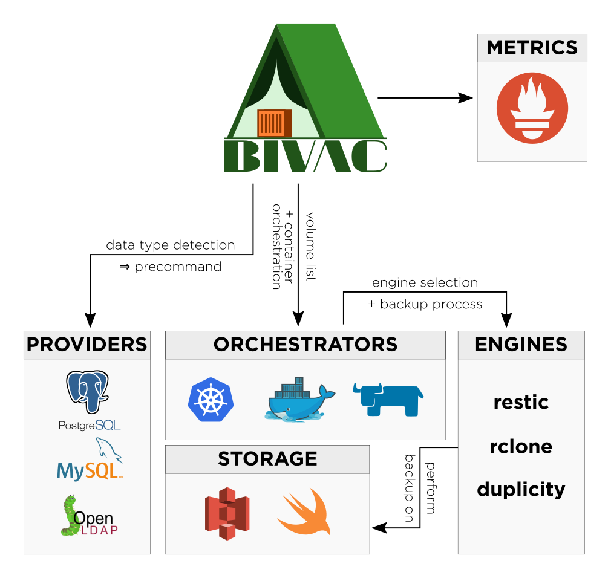

Bivac : Backup Interface for Volumes Attached to Containers
===========================================================

Website: [https://camptocamp.github.io/bivac](https://camptocamp.github.io/bivac)


[](https://hub.docker.com/r/camptocamp/bivac/)
[](https://travis-ci.org/camptocamp/bivac)
[](https://coveralls.io/r/camptocamp/bivac?branch=master)
[](https://goreportcard.com/report/github.com/camptocamp/bivac)
[](http://www.camptocamp.com)


Bivac lets you backup all your containers volumes deployed on Docker Engine or Kubernetes using Restic, Duplicity or RClone.


## Installing

```shell
$ go get github.com/camptocamp/bivac
```

## Usage

```shell
Usage:
  bivac [OPTIONS]

Application Options:
  -V, --version                           Display version.
  -l, --loglevel=                         Set loglevel ('debug', 'info', 'warn', 'error', 'fatal', 'panic'). (default: info) [$BIVAC_LOG_LEVEL]
  -b, --blacklist=                        Volumes to blacklist in backups. [$BIVAC_VOLUMES_BLACKLIST]
  -w, --whitelist=                        Only backup whitelisted volumes. [$BIVAC_VOLUMES_WHITELIST]
  -m, --manpage                           Output manpage.
      --no-verify                         Do not verify backup. [$BIVAC_NO_VERIFY]
  -j, --json                              Log as JSON (to stderr). [$BIVAC_JSON_OUTPUT]
  -E, --engine=                           Backup engine to use. (default: restic) [$BIVAC_ENGINE]
  -o, --orchestrator=                     Container orchestrator to use. [$BIVAC_ORCHESTRATOR]
  -u, --target-url=                       The target URL to push to. [$BIVAC_TARGET_URL]
      --check-every=                      Time between backup checks. (default: 24h) [$BIVAC_CHECK_EVERY]
      --label-prefix=                     The volume prefix label. [$BIVAC_LABEL_PREFIX]
      --extra-env=                        Extra environment variables to share with workers. [$BIVAC_EXTRA_ENV]
  -p, --providers-file=                   Path to providers configuration file. (default: /providers-config.default.toml) [$BIVAC_PROVIDERS_FILE]

Restic Options:
      --restic-args=                      Arguments to pass to restic engine. (default: -r %B/%P/%V) [$RESTIC_COMMON_ARGS]
      --restic-backup-args=               Arguments to pass to restic engine when backup. (default: %D --hostname %H) [$RESTIC_BACKUP_ARGS]
      --restic-forget-args=               Arguments to pass to restic engine when launching forget. (default: --keep-daily 15 --prune) [$RESTIC_FORGET_ARGS]
      --restic-image=                     The restic docker image. (default: restic/restic:latest) [$RESTIC_DOCKER_IMAGE]
      --restic-password=                  The restic backup password. [$RESTIC_PASSWORD]

RClone Options:
      --rclone-args=                      Arguments to pass to rclone engine. [$RCLONE_COMMON_ARGS]
      --rclone-backup-args=               Arguments to pass to rclone engine when backup. (default: %D %B/%P/%V) [$RCLONE_BACKUP_ARGS]
      --rclone-image=                     The rclone docker image. (default: camptocamp/rclone:1.42-1) [$RCLONE_DOCKER_IMAGE]

Duplicity Options:
      --duplicity-args=                   Arguments to pass to duplicity engine. (default: --s3-use-new-style --ssh-options -oStrictHostKeyChecking=no --no-encryption) [$DUPLICITY_COMMON_ARGS]
      --duplicity-backup-args=            Arguments to pass to duplicity engine when backup. (default: --full-if-older-than 15D --allow-source-mismatch --name %V %D %B/%P/%V)
                                          [$DUPLICITY_BACKUP_ARGS]
      --duplicity-remove-older-than-args= Arguments to pass to duplicity engine when removing old backups. (default: 30D --force --name %V %B/%P/%V) [$DUPLICITY_REMOVE_OLDER_THAN_ARGS]
      --duplicity-image=                  The duplicity docker image. (default: camptocamp/duplicity:latest) [$DUPLICITY_DOCKER_IMAGE]

Metrics Options:
  -g, --gateway-url=                      The prometheus push gateway URL to use. [$PUSHGATEWAY_URL]

AWS Options:
      --aws-access-key-id=                The AWS access key ID. [$AWS_ACCESS_KEY_ID]
      --aws-secret-key-id=                The AWS secret access key. [$AWS_SECRET_ACCESS_KEY]

Swift Options:
      --swift-username=                   The Swift user name. [$SWIFT_USERNAME]
      --swift-password=                   The Swift password. [$SWIFT_PASSWORD]
      --swift-auth_url=                   The Swift auth URL. [$SWIFT_AUTHURL]
      --swift-tenant-name=                The Swift tenant name. [$SWIFT_TENANTNAME]
      --swift-region-name=                The Swift region name. [$SWIFT_REGIONNAME]
      --swift-user-domain-name=           The Swift user domain name. [$SWIFT_USER_DOMAIN_NAME]
      --swift-project-name=               The Swift project name. [$SWIFT_PROJECT_NAME]
      --swift-project-domain-name=        The Swift project domain name. [$SWIFT_PROJECT_DOMAIN_NAME]

Docker Options:
  -e, --docker-endpoint=                  The Docker endpoint. (default: unix:///var/run/docker.sock) [$DOCKER_ENDPOINT]

Kubernetes Options:
      --k8s-namespace=                    Namespace where you want to run Bivac. [$K8S_NAMESPACE]
      --k8s-all-namespaces                Backup volumes of all namespaces. [$K8S_ALL_NAMESPACES]
      --k8s-kubeconfig=                   Path to your kubeconfig file. [$K8S_KUBECONFIG]
      --k8s-worker-service-account=       Specify service account for workers. [$K8S_WORKER_SERVICE_ACCOUNT]

Cattle Options:
      --cattle-env=                       The Cattle environment. [$CATTLE_ENV]
      --cattle-accesskey=                 The Cattle access key. [$CATTLE_ACCESS_KEY]
      --cattle-secretkey=                 The Cattle secretkey. [$CATTLE_SECRET_KEY]
      --cattle-url=                       The Cattle url. [$CATTLE_URL]

Help Options:
  -h, --help                              Show this help message
```

## Examples

### Backup all named volumes to S3 using Restic

```shell
$ bivac \
  -o docker \
  -u s3:s3.amazonaws.com/<my_bucket>/<my_dir> \
  --aws-access-key-id=<my_key_id> \
  --aws-secret-key-id=<my_secret_key> \
  --restic-password=<my_restic_password>
```


### Using docker

```shell
$ docker run -v /var/run/docker.sock:/var/run/docker.sock:ro  --rm -ti \
   -e BIVAC_TARGET_URL=s3:s3.amazonaws.com/<my_bucket>/<my_dir> \
   -e AWS_ACCESS_KEY_ID=<my_key_id> \
   -e AWS_SECRET_ACCESS_KEY=<my_secret_key> \
   -e RESTIC_PASSWORD=<my_restic_password> \
     camptocamp/bivac
```


## Controlling backup parameters

The parameters used to backup each volume can be fine-tuned using volume labels (requires Docker 1.11.0 or greater):

- `io.bivac.ignore=true` ignores the volume
- `io.bivac.no_verify=true` skips verification of the volume's backup (faster)
- `io.bivac.duplicity.full_if_older_than=<value>` sets the time period after which a full backup is performed. Defaults to the `BIVAC_FULL_IF_OLDER_THAN` environment variable value
- `io.bivac.duplicity.remove_older_than=<value>` sets the time period after which to remove older backups. Defaults to the `BIVAC_REMOVE_OLDER_THAN` environment variable value

If you cannot use volume labels, you can drop a `.bivac.overrides` file at the root of the volume:

```ini
engine = "rclone"
no_verify = true
ignore = false
target_url = "s3:foo/bar"

[duplicity]
full_if_older_than = "3D"
remove_older_than = "5D"
```

## Orchestrators

Bivac supports runing on either Docker Engine (using the Docker API), Kubernetes (using the Kubernetes API) or Rancher Cattle (using the Cattle API).

### Docker

Bivac will backup all named volumes by default.

### Kubernetes

Bivac will backup all Persistent Volume Claims by default.

### Cattle

Bivac will backup all Volumes by default.

## Providers

Bivac detects automatically the kind of data that is stored on a volume and adapts its backup strategy to it. The following providers and associated strategies are currently supported:

* PostgreSQL: Run `pg_dumpall` before backup
* MySQL: Run `mysqldump` before backup
* OpenLDAP: Run `slapcat` before backup
* Default: Backup volume data as is


## Engines

Bivac supports various engines for performing the backup:

* Restic
* RClone: use for heavy data that Restic or Duplicity cannot manage efficiently
* Duplicity

You can set the engine with either:

* an `io.bivac.engine` volume label (requires Docker 1.11.0 or great)
* a global setting using the `BIVAC_ENGINE` environment variable
* the `engine` parameter in the `.bivac.overrides` file at the root of the volume


## Return code

Bivac returns:

* `0` if nothing failed
* `1` if a backup failed
* `2` if pushing metrics to Prometheus failed


## Architecture


